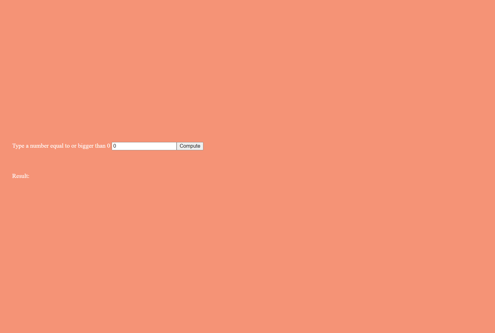

# BracketCoCo

## Prerequisites

You must have:

- Java 1.8 JDK
- Maven 3.6.3 or/and IntelliJ IDEA 2021.2.2 or equivalent idea with bundled Maven.
- Web Browser(Microsoft Edge, Google Chrome, ...)

Please check the links below for further information.

https://www.azul.com/downloads/?package=jdk

http://maven.apache.org/install.html

https://www.jetbrains.com/help/idea/installation-guide.html

## Installing the source code

You can download the source code directly or clone it.

Please check the links below for further information.

https://docs.github.com/en/repositories/creating-and-managing-repositories/cloning-a-repository

## Running the application via

### 1. IntelliJ IDEA 2021.2.2

1. Open the IntelliJ IDEA application.
2. Locate the "Open" button in the interface and click it.
3. Select the project source code folder from the file selector window and, once you select it, hit the "OK" button.
4. If the application asks do you trust this project, please consider selecting the "Trust" option.
5. Locate the sideways Maven text closer to the top right side of the screen.
    1. If you changed the IntelliJ default layout, this step might not apply to you.
6. Click the "Reload All Maven Projects" button, which should be the left-most button of the expanded Maven panel.
7. From here on there are multiple ways to run the project please continue to one of the sections below.

#### 1.1. Execute Maven Goal

1. Select the "M" icon from the top bar of the expanded Maven panel.
2. Please delete the existing text and write ```mvn clean install tomee:run```.
3. Please wait until you see something similar to the following text "Deployment of web application archive ... has
   finished in ... ms" on the "Run" tab.
4. Open up your web browser.
5. Traverse to http://localhost:8080/bracketcoco
6. You can now start using the application.

#### 1.2. Execute Maven Goal

1. Expand the "BracketCoCo" item from the expanded Maven panel.
2. Expand the "Lifecycle" item from the expanded "BracketCoCo" items.
3. Double-click on "clean". Once execution finishes, continue the list.
4. Double-click on "install". Once execution finishes, continue the list.
5. Expand the "Plugins" item from the expanded "BracketCoCo" items.
6. Locate the "tomee" item and expand it.
7. Double-click on "tomee:run".
8. Please wait until you see something similar to the following text "Deployment of web application archive ... has
   finished in ... ms" on the "Run" tab.
9. Open up your web browser.
10. Traverse to http://localhost:8080/bracketcoco
11. You can now start using the application.

### 2. PowerShell

1. Open a PowerShell window using administrator rights.
2. Travel to project source code folder.
    1. You can use the following command ```cd "the absolute path to the project source code folder"``` to achieve this
       step.
3. After opening the project source code folder you can run the following command ```mvn clean install tomee:run```.
4. Please wait until you see something similar to the following text "Deployment of web application archive ... has
   finished in ... ms" on the "Run" tab.
5. Open up your web browser.
6. Traverse to http://localhost:8080/bracketcoco
7. You can now start using the application.

## How To Use The Application



1. You can enter a number from "Type a number equal to or bigger than 0" section.
2. Once a valid number is entered you can click count and get your results below the "Result:" section.

> A loading text can be seen once "Compute" button is clicked.